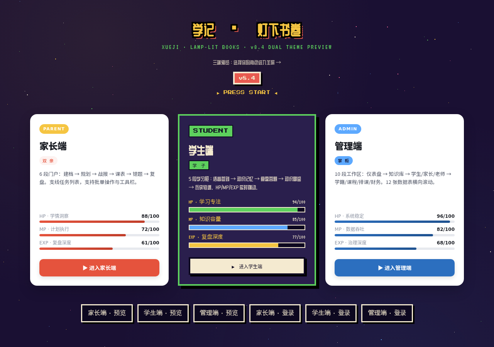
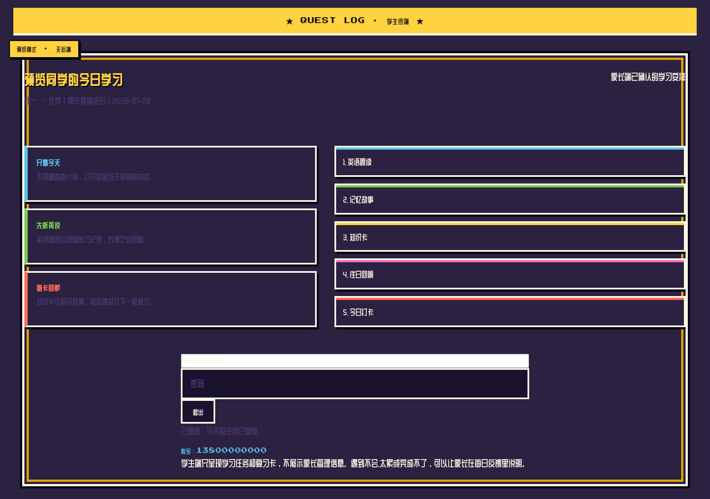
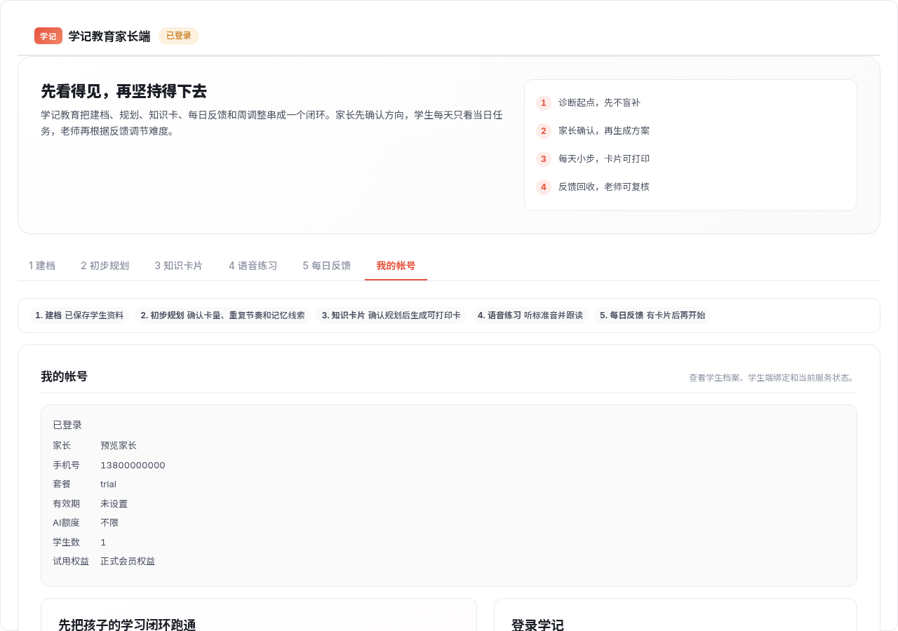
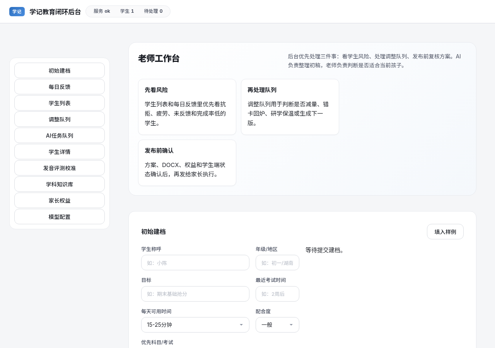

# 学记 · 灯下书卷 — 前端 MVP Demo

> 本仓库仅包含**前端工作分支**（`mvpdemo`），是基于原项目 [realwindjpn/xueji-loop](https://github.com/realwindjpn/xueji-loop) 的前端贡献成果。

## 贡献者声明

**前端贡献者：朱曦策**

本仓库的所有前端工作由朱曦策完成。原项目 `realwindjpn/xueji-loop` 是一个学记教育平台（家长端 / 学生端 / 管理端 H5 服务），包含后端逻辑与数据层。本仓库**仅提取前端部分**，不涉及后端、数据库或服务端逻辑的修改。

---

## 项目概述

学记·灯下书卷是一个三端教育 H5 平台：

| 页面 | 文件 | 说明 |
|------|------|------|
| 着陆页 | `web/index.html` | 双主题入口，展示三端入口卡 |
| 学生端 | `web/student.html` | 像素 RPG 风格学习界面 |
| 家长端 | `web/parent.html` | 极简现代·卡片式家长门户 |
| 管理端 | `web/admin.html` | 极简现代·卡片式管理后台 |

---

## 前端工作成果

以下是从 v6 到 v8.5 的完整前端迭代历程：

### v6 · 灯下书卷 · 单层重写
- 将原有前端代码进行单层重写，建立整洁的代码结构基础

### v7 · 灯下书卷 — 真实台灯 + 文房五色 + 灯下渐显
- 引入真实台灯视觉意象
- 文房五色配色体系
- 灯下渐显动效

### v8 · 像素 RPG 主题
- 参考像素 RPG 模板，为学生端打造沉浸式游戏化学习界面
- 深紫色调 + Press Start 2P 像素字体
- 标题屏 + 任务日志 + 对话框组件

### v8.1 · 松绑布局
- 放大字号、加大行距、放宽间距
- 溢出防御（防止内容溢出容器边界）

### v8.2 · 布局统一
- 建立共享响应式布局原语（3 端共用布局基类）
- 新增响应式溢出审计工具（4 视口 × 3 页面 = 12 项检查）
- 对齐布局工具与打包 HTML 文件

### v8.3 · 学生端宽屏平铺
- `>=1280px` 视口解锁 `.frame 1180px` 瓶颈
- 仪表盘多列布局（宽屏自动平铺）
- 解决学生端页面在宽屏下无法适应平铺的问题

### v8.4 · 双主题架构（核心里程碑）
- **家长端 / 管理端**从像素 RPG 切换为**极简现代·卡片式**主题
- 浅灰底 + 朱砂橙强调色 + 大圆角卡片
- 通过 `build/inject.py` 注入器按文件分派主题 CSS + 引擎 JS：
  - 学生端 → `theme-xueji.css`（像素 RPG）+ `fx-engine.js`（完整特效）
  - 家长端 / 管理端 → `theme-minimal.css`（极简卡片）+ `fx-engine-minimal.js`（精简特效）

### v8.4.1 · 交互截图系统
- 追加 `build/shoot-interactive.js`：14 张多视口 / 交互截图
- 自动化截图覆盖关键交互流程

### v8.4.2 · 着陆页
- 新建 `web/index.html` 着陆页：v8.4 双主题版
- 学生端像素 RPG 入口 + 家长·管理端极简卡片入口

### v8.5 · 着陆页抛光
- 着陆页双主题入口卡精修
- 输入框视觉抛光（焦点态、过渡动效、统一间距）

### v8.6 · 全端 Mock 交互（核心功能）
- **三端登录均可交互**：填写手机号 + 密码 → 点击登录 → 进入各自主界面，全程不走后端验证接口
- 学生端：点击 PRESS START 进入主屏 → 填写登录表单 → 加载今日学习任务（语音跟读 / 记忆故事 / 知识卡 / 往日回顾）
- 家长端：填写登录表单 → 进入 6 段门户（建档 / 规划 / 战报 / 课表 / 错题 / 复盘），支持注册、建档、反馈提交等交互
- 管理端：预览模式自动跳过口令弹窗 → 进入后台仪表盘，展示学生 / 家长列表、AI 任务队列等
- **技术实现**：统一 mock 层（fx-engine / fx-engine-minimal）拦截所有 `/api/*` fetch 请求，返回预置占位数据；Response-like 对象模拟真实 HTTP 响应；80-180ms 随机延迟模拟网络

---

## 技术架构

### 双主题分派

```
build/inject.py（注入器）
├── theme-xueji.css    → 学生端（像素 RPG · 深紫 + Press Start 2P）
├── theme-minimal.css   → 家长端 / 管理端（极简卡片 · 浅灰 + 朱砂橙）
├── fx-engine.js        → 学生端完整特效引擎
└── fx-engine-minimal.js → 家长端 / 管理端精简特效引擎
```

注入器读取源 HTML，按终端类型替换 `<style>` 块并注入对应的 fx-engine，实现单次构建、三端分派。

### 布局审计门

`build/layout-audit.js` 是 v8 系列的硬验收标准：

- 3 个页面（student / parent / admin）× 4 个视口（375px / 768px / 1024px / 1280px）
- 共 12 项布局检查，全部 PASS 方可合入
- 使用 Puppeteer 自动化截图 + 像素级溢出检测

### 工具链

| 工具 | 用途 |
|------|------|
| `build/inject.py` | 主题 / 引擎注入器（Python） |
| `build/layout-audit.js` | 布局审计门（Node.js + Puppeteer） |
| `build/shoot-v84.js` | v8.4 系列截图脚本 |
| `build/shoot-interactive.js` | 交互流程截图（14 张） |
| `build/shoot-landing.js` | 着陆页截图 |
| `build/wide-test.js` | 宽屏平铺测试 |

---

## 页面预览

### 着陆页（双主题入口）



### 学生端（像素 RPG · 登录后今日学习）



### 家长端（极简卡片 · 登录后门户）



### 管理端（极简卡片 · 后台仪表盘）



---

## 分支说明

本仓库仅保留一个工作分支：

- **`mvpdemo`** — 当前工作分支，包含 v6 → v8.5 全部前端成果

原始项目地址：[realwindjpn/xueji-loop](https://github.com/realwindjpn/xueji-loop)

## 致谢

感谢原项目 [realwindjpn/xueji-loop](https://github.com/realwindjpn/xueji-loop) 提供的学记教育平台基础。本仓库仅对其前端部分进行了设计、布局和交互层面的工作。
